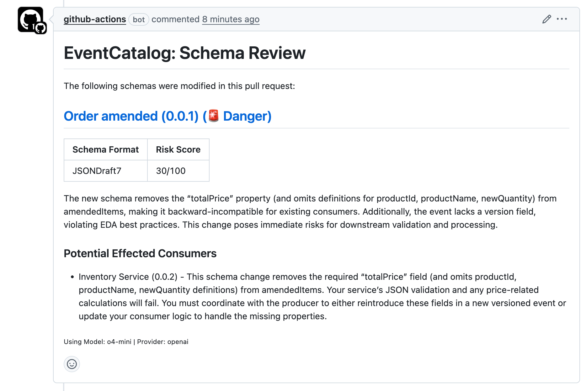

<div align="left">

<h1>EventCatalog GitHub Action</h1>

<p>The EventCatalog GitHub Action brings AI-powered insight into your Git workflows. It uses large language models (LLMs) to automatically review changes to your EventCatalog, helping you catch issues early—before they reach production.</p>

<p>Think of it as a smart assistant for your pull requests. It doesn't just lint code—it understands the implications of your changes.</p>



</div>

<hr/>

## Usage

To quickly get started, create a new .github/workflows/eventcatalog-ci.yaml file in your repository with the following content:

```yaml
name: EventCatalog CI
on:
  push:
  pull_request:
    types: [opened, synchronize, reopened, labeled, unlabeled]
  delete:
permissions:
  contents: read
  pull-requests: write
jobs:
  schema_review:
    runs-on: ubuntu-latest
    steps:
      - uses: actions/checkout@v4
      - uses: event-catalog/github-action@main
        with:
          # The task to run, currently only schema_review is supported
          task: schema_review
          # The AI LLM provider to use (openai, anthropic, google)
          provider: openai

          # The model to use for the task, defaults to o4-mini
          # Find the models in the documentation below
          model: o4-mini

          # Your API KEY for the LLM provider
          api_key: ${{ secrets.OPENAI_API_KEY }}
          
          # Your EventCatalog Scale License key
          license_key: ${{ secrets.EVENT_CATALOG_LICENSE_KEY }}

```

This will perform schema reviews on every pull request. If any schema in your EventCatalog has changed for your events, queries or commands the action will comment on the pull request with a summary of the changes and a score of how likely the change is to cause issues.

You can configure the action, choose provides (OpenAI, Anthropic, Google), models (o4-mini, claude-3-5-sonnet-20240620, gemini-2.0-flash-001), and more.

## Documentation

You can find more information about the action and more configuration options in the [EventCatalog GitHub Action documentation](https://www.eventcatalog.dev/docs/development/guides/integrate-with-ci-cd/github-action).

## License

This project is licensed under the [BSL-1.1](./LICENSE) license and requires a license key to use. You can get a 14 day free trial at https://eventcatalog.cloud/. If you do not have a license key, the action will fail.